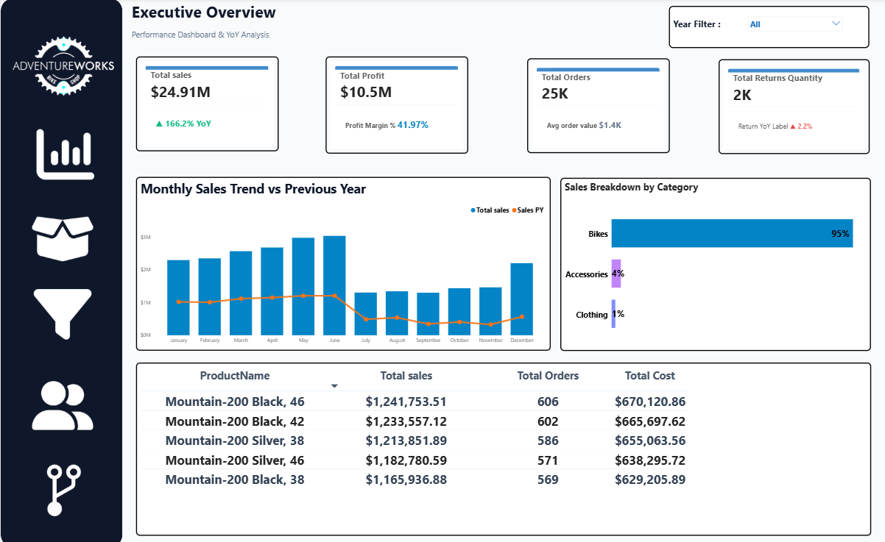
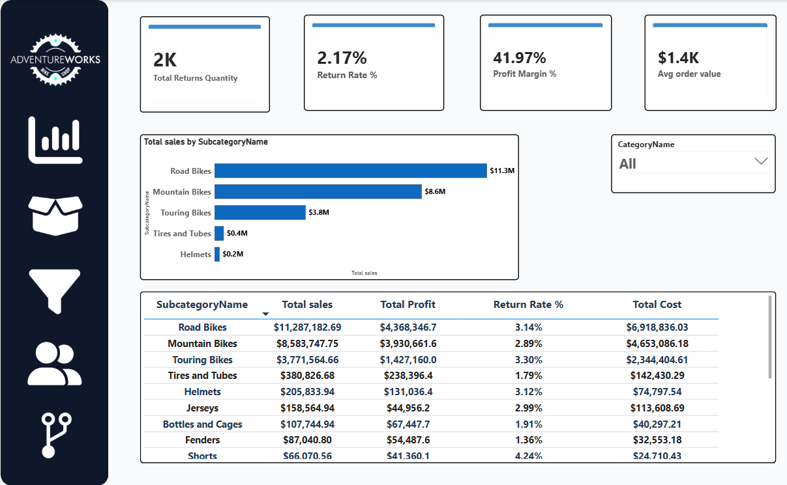
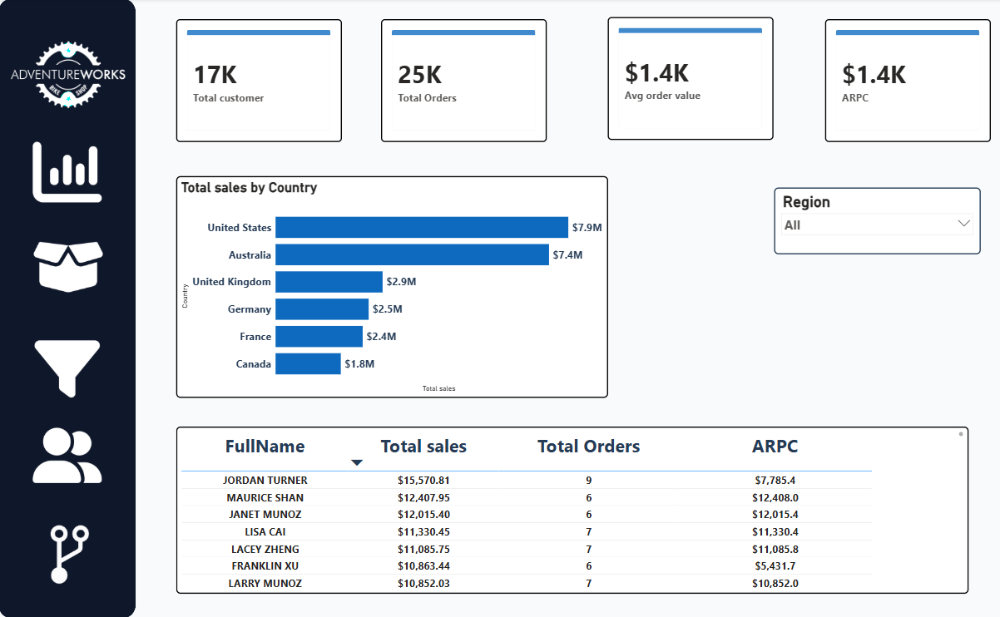
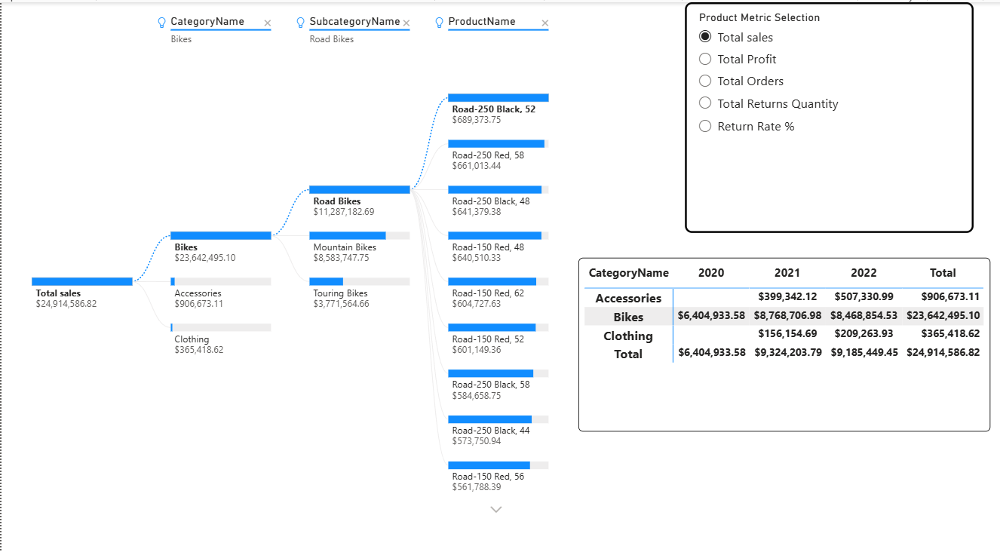
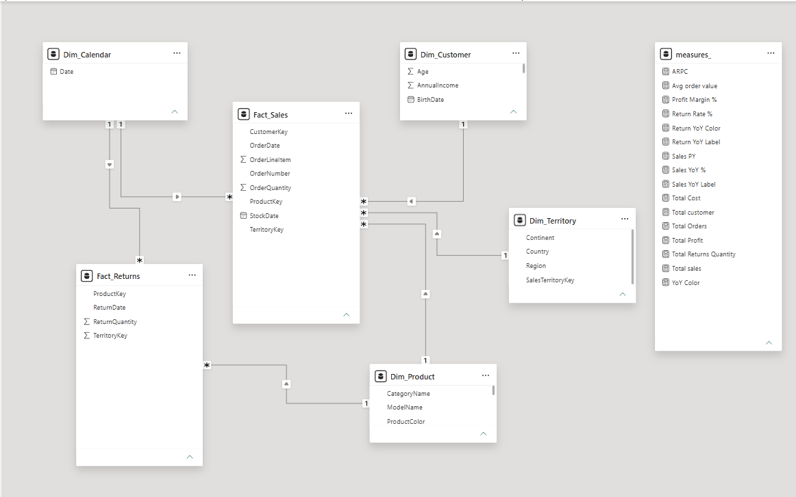

# 🚴 AdventureWorks Sales Performance & Business Intelligence Dashboard

An end-to-end Power BI analytics and data modeling project for **AdventureWorks Cycles**. This project provides executive-level decision support by analyzing sales performance, profit margins, regional trends, product category breakdowns, and return rates.

---

## 👤 Author
- **Name:** Ali Maghraby
- **Role:** Data Analyst / Business Intelligence Specialist
- **Tooling:** Power BI Desktop, DAX, Data Modeling (Star Schema)

---

## 📊 Key Highlights & Metrics
- 💰 **Total Revenue:** **$24.91M** (*+166.2% YoY*)
- 📈 **Total Profit:** **$10.50M** (*41.97% Profit Margin*)
- 📦 **Total Orders:** **25K** (*Average Order Value: $1.4K*)
- 👥 **Total Customers:** **17K** (*Average Revenue Per Customer / ARPC: $1.4K*)
- 🔄 **Return Rate:** **2.17%** (*2K units returned*)

---

## 🖼️ Dashboard Architecture & Views

### 1. Executive Overview & YoY Analysis
Focuses on high-level KPIs, monthly performance vs. previous year (`Sales PY`), category breakdown (**Bikes 95%**, **Accessories 4%**, **Clothing 1%**), and top-selling products.

---

### 2. Product Detail & Subcategory Ranking
Ranks subcategories by sales revenue and profit margin (**Road Bikes $11.3M**, **Mountain Bikes $8.6M**, **Touring Bikes $3.8M**). Tracks unit costs and product return rates.

---

### 3. Customer & Regional Analysis
Analyzes revenue by country (**USA $7.9M**, **Australia $7.4M**, **UK $2.9M**, **Germany $2.5M**, **France $2.4M**, **Canada $1.8M**) and tracks top individual customers.

---

### 4. Product Performance & Decomposition Tree
Utilizes Power BI's AI Decomposition Tree to trace sales drivers from Category down to Product SKU level across 2020–2022.

---

## 🧩 Data Model Architecture (Star Schema)
The dataset is structured into a clean Star Schema comprising **2 Fact Tables** and **4 Dimension Tables**:
- `Fact_Sales` ── linked to `Dim_Customer`, `Dim_Product`, `Dim_Territory`, `Dim_Calendar`
- `Fact_Returns` ── linked to `Dim_Product`,`Dim_Calendar`

---

## 🧮 Custom DAX Measures Table (`measures_`)
Centralized inside a dedicated measure table:
- **Time Intelligence:** `Sales PY`, `Sales YoY %`, `Return YoY Label`
- **Core Financials:** `Total Sales`, `Total Profit`, `Profit Margin %`, `Total Cost`
- **Customer Metrics:** `ARPC`, `Total Customer`, `Avg order value`
- **Quality & Returns:** `Total Returns Quantity`, `Return Rate %`

---

## 🔗 Project Resources & Live Files
📁 **Access Full Project Files & Documentation (Power BI .pbix & Reports):**  
👉 [Google Drive Project Folder](https://drive.google.com/drive/folders/1_4GbuYj-UvoSdRTT8sEnX6Do0-zYk2te?usp=sharing)
